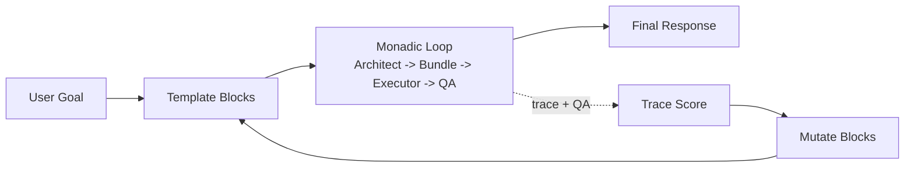

# Flow of Information

This document describes how information moves through MPP’s combined pipelines,
where mutations occur, and which stages only append feedback.

## Overview
MPP operates in two loops:
- **Monadic refinement loop (per request):** Architect -> Bundle -> Executor ->
  QA -> feedback.
- **Template optimization loop (per case):** mutates prompt blocks to reduce
  monadic-loop friction for that case over time.

Only the **template optimization** loop mutates templates. The **monadic**
loop does not
rewrite prior context; it appends feedback and retries until stable.

## DSPy Components (How They Connect)
- `MPPAutoAdapter`: DSPy module that runs the monadic loop for a single request.
- `MPPVerticalRefiner`: wrapper around the same monadic loop with explicit
  `build_bundle` / `execute` / `run` entry points.
- `MPPAutoAdapterOptimizer`: DSPy teleprompter that compiles an optimized
  `MPPAutoAdapter` from a single case (template optimization).

Flow:
1. Start with `MPPAutoAdapter` (monadic runtime behavior).
2. Use `MPPAutoAdapterOptimizer.compile()` with a single case to produce an
   optimized adapter.
3. The compiled adapter still runs the same monadic loop; only the prompt
   blocks (primers/strategy payload) are updated.

## Monadic Refinement (Per Request)
1. **Entry prompt + strategy payload + raw user goal** are composed.
2. **Architect** derives a protocol spec and payload bundle.
3. **Executor** runs the bundle to generate a final response.
4. **MCP tools (optional)** execute in the declared `mcp_tooling.call_order`
   when the derivative protocol requires structured tool usage.
5. **QA** validates the response.
   - **Open-world:** QA runs every iteration; a pass ends the loop.
   - **Closed-world:** QA runs once after executor stabilization.
5. **Feedback** is appended and the loop retries:
   - Architect receives the previous bundle plus error/QA feedback.
   - Executor receives QA feedback when available.

The original user goal is preserved verbatim inside `<RAW_USER_GOAL>...</RAW_USER_GOAL>`.
Feedback is appended, not substituted.

## Template Optimization (Per Case)
1. Start with a template containing mutable blocks (e.g., `architect_primer`,
   `executor_primer`, `strategy_payload`).
2. Run **monadic refinement** for the case and collect traces.
3. Score traces (stability + QA) and keep the best template.
4. Mutate allowed blocks only, using trace history to guide edits.

The template optimization loop **does not** alter user goals or the MPP bundle
structure. It only edits declared mutable blocks.

## Mutation Boundaries
- **Mutable:** template blocks marked with `{{MPP_MUTABLE:...}}`.
- **Immutable:** MPP bundle keys/order, raw user goal, and non-mutable template
  text.
- **Feedback:** appended to prompts (previous bundle + QA verdicts), never used to
  overwrite the original goal.

## Combined Flow (Mermaid)

