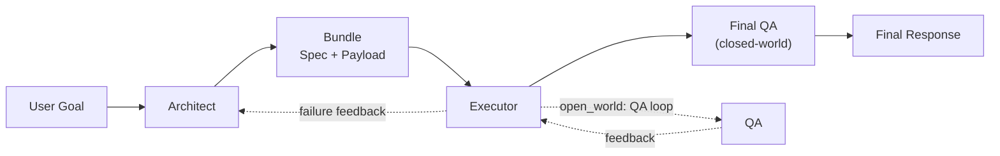

# MPP: Meta-Prompting Protocol

[](https://opensource.org/licenses/MIT)
[](docs/meta_prompting_protocol_spec.md)
[](https://gabrielbarberini.github.io/meta-prompting-protocol/)
[](https://deepwiki.com/GabrielBarberini/meta-prompting-protocol)

**MPP is a framework for generating self-describing, task-specific AI communication protocols on the fly.**

---

### The Problem with "Flat" Prompts

Traditional prompts are monolithic blocks of text. They are often ambiguous, hard to validate, and lead to unreliable and inconsistent responses from AI models. As tasks become more complex, these prompts become brittle and difficult to maintain.

### The Solution: A Self-Describing Protocol

MPP introduces a two-stage workflow with two key agents:

1.  **The Protocol Architect:** An AI that analyzes a user's goal and generates a **bespoke Derivative Protocol** (like a custom API) perfectly suited for transmiting the task.
2.  **The Executor:** An AI that receives a bundle containing both the **newly generated protocol** and a **payload** encoded according to that protocol. It learns the rules just-in-time and executes the task with precision.

Note: the Architect is instructed to preserve the raw user goal verbatim in the
payload’s primary instruction tag to avoid accidental drift during refinement.

This makes every prompt a self-contained structured package, reducing ambiguity and helping Executors know *exactly* what is required.

### How It Works: A Quick Look

An MPP bundle contains the full rulebook alongside the data.

```json
{
  "derivative_protocol_specification": {
    "protocol_name": "Creative Writing Protocol (CWP)",
    "core_tag_library": {
      "$genre": { "..." },
      "$plot_points": { "..." }
    },
    "...": "..."
  },
  "derivative_protocol_payload": {
    "$genre": "Horror",
    "$plot_points": ["A lone lighthouse keeper...", "..."]
  }
}
```

#### Workflow Diagram



#### Example Workflow
1.  **User Input:** "Write a horror story about a lighthouse keeper."
2.  **Protocol Architect (MPP aware):** Derivates a MPP compliant protocol on the fly with tags like `$genre` and `$plot_points`. Then encodes the user's request accordingly and bundles it with the generated protocol spec.
3.  **Executor (MPP aware):** Receives the bundle, learns the new protocol, and generates a horror story based on the structured payload.

#### Optimization Overview
MPP exposes two optimization systems:
- **Monadic refinement:** retries a single request using QA/validation feedback to
  recover missing info or compliance until it converges. This is the default
  behavior of `MPPAutoAdapter`.
- **Template optimization:** wraps the monadic loop in a TextGrad-style mutation
  cycle to find a prompt framing that converges faster (fewer retries). This is
  what `MPPAutoAdapterOptimizer` compiles.

#### Quick Start

##### DSPy
If you are using DSPy, `MPPAutoAdapter` wraps the full MPP workflow as a single module.
Example: monadic refinement only.

```python
import dspy

from mpp_dspy import MPPAutoAdapter

lm = dspy.OpenAI(model="gpt-4o-mini")
dspy.settings.configure(lm=lm)

program = MPPAutoAdapter()
result = program(
  user_goal="Draft a crisp product launch email.",
  open_world=True,
)
print(result.final_response)
```

To plug in a custom provider, supply any DSPy-compatible LM to
`dspy.settings.configure`. See `mpp_dspy/README.md` for notes.

For full template optimization + monadic refinement, use
`MPPAutoAdapterOptimizer` as a DSPy teleprompter to compile an optimized
`MPPAutoAdapter` for a single case (see `mpp_dspy/README.md`). Example: template
optimization + monadic refinement.

```python
import dspy

from mpp_dspy import DefaultLongitudinalMutator, MPPAutoAdapter, MPPAutoAdapterOptimizer

lm = dspy.OpenAI(model="gpt-4o-mini")
dspy.settings.configure(lm=lm)

case = {"user_goal": "Produce a structured risk checklist.", "open_world": True}

program = MPPAutoAdapter()
optimizer = MPPAutoAdapterOptimizer(
  template=YOUR_TEMPLATE,
  mutate_function=DefaultLongitudinalMutator(lm),
)
optimized = optimizer.compile(program, trainset=case)
result = optimized(user_goal="Draft a crisp launch email.", open_world=True)
print(result.final_response)
```

If you want parallel candidates, run multiple `MPPAutoAdapterOptimizer` instances
in parallel; each run is a full pipeline for a single case. Compare
`optimized.longitudinal_result.score` to pick the best.

##### TextGrad-ready templates (optional)
If you apply TextGrad or any prompt optimizer, keep the MPP structure intact and
only mutate explicitly tagged blocks. MPP does not interpret the tokens; they
serve as guardrails for your optimizer.

Example (template tokens mark mutable segments):

```
You are a Protocol Architect.
{{MPP_MUTABLE:architect_primer}}
Keep outputs minimal and schema-compliant.
{{/MPP_MUTABLE}}
Always output JSON.
```

Recommended mutable blocks:
`architect_primer`, `executor_primer`, `strategy_payload`, plus protocol content
(tag sets, schema keys, processor names, payload fields). Keep the entry prompt
fixed to avoid mutating the user goal or intent. Only the MPP spec text itself
and the required bundle structure/order stay immutable.

Optimization uses two loops:
- Template optimization loop (TextGrad or other optimizers) mutates allowed text
  segments to improve convergence for a case (run multiple cases separately if
  needed).
- Monadic refinement loop retries per request to stabilize a single
  bundle/execution with validation/QA feedback.
See `FLOW_OF_INFORMATION.md` for a step-by-step data flow breakdown.


Template-optimization scoring is pluggable via `LongitudinalMetric`, which
replaces the default trace-cost metric used by `MPPAutoAdapterOptimizer`.
The default `TraceCostMetric` uses a dominant final-response weight and doubles
weights as you move outward (defaults: final=4, architect=2, executor=1).
Override `final_weight` to scale the set or pass explicit weights. If the
bundle/executor fails to stabilize or QA fails, the case score is 0.

##### Customization Interfaces
Modular pieces you can swap without changing the core flow:
- `DefaultLongitudinalMutator`: default mutation policy (keeps `entry_prompt`
  fixed; mutates `strategy_payload`, `architect_primer`, `executor_primer`).
- `LongitudinalMetric`: scoring interface (default `TraceCostMetric`).
- `mutate_function`: mutation hook used by `MPPAutoAdapterOptimizer` and
  `MPPLongitudinalRefiner`.
- `MPPLongitudinalRefiner`: lower-level teleprompter if you want a custom
  `score_function` instead of `LongitudinalMetric`.
- `architect_lm` / `executor_lm` / `qa_lm`: per-stage model selection.
- `architect_role_instructions` / `executor_role_instructions` / `qa_role_instructions`:
  custom role primers.
- `scripts/mpp_e2e_template.py`: provider-agnostic template to run
  MPPAutoAdapterOptimizer end-to-end and save the best adapter template locally.
- `mcp_tooling` (optional spec field): declare MCP tool schemas and call order
  when Executors must perform tool calls before final response.
- `MPPAutoAdapterOptimizer`: DSPy teleprompter that searches for the best
  MPPAutoAdapter framing for a single case while preserving the MPP spec.

##### Two-Loop Optimization (Why both loops matter)
You can view MPP as a two-loop system:
- **Inner (monadic refinement):** guarantees correctness for a single request,
  but can be costly if it needs multiple retries.
- **Outer (template optimization):** tunes prompts for a case to reduce that
  inner-loop cost over time.

Important: do not score template-optimization updates solely on the final
answer. If the monadic loop "fixes" errors, the prompt can look perfect while
still being expensive. Instead, score the trace cost (iteration counts, QA
failures, validation errors). If a bundle or executor never stabilizes, treat it
as max loss and move on. The goal is not just convergence, but faster
convergence.

##### Raw
Download the [MPP Specification](docs/meta_prompting_protocol_spec.md) and attach it to an AI model session. Frame the AI as a "Protocol Architect" or "Executor" and start generating or executing MPP bundles.

E.g., to create a Protocol Architect:

```
Read the MPP specification. You are now a Protocol Architect. Your job is to create bespoke Derivative Protocols based on user goals.
```

E.g., to create an Executor:

```
Read the MPP specification. You are now an Executor. Your job is to execute tasks based on received MPP bundles.
```

Then using Gemini 2.5 Pro as an a Protocol Architect, after being primed with the MPP spec, you might say:

```
Derivate an appropriate protocol and build a MPP bundle encoding the following prompt with it "Act as a medieval blacksmith. A customer asks you for a mythical sword called 'Glimmerfang'. Describe the sword you would forge for them. Do not use the letter 'e' in your entire response. Also, do not mention magic or any mythical creatures."
```

And it would respond with a complete MPP bundle ready for an Executor to process e.g
```json
{
  "meta_protocol_version": "1.4.0",
  "derivative_protocol_specification": {
    "protocol_name": "Constrained Persona Protocol (CPP)",
    "protocol_version": "1.0",
    "abstract": "A protocol for generating creative text from a specific persona's point of view, while adhering to a strict set of stylistic and content-based output constraints.",
    "guiding_principles": {
      "fidelity": "The persona and constraints must be followed with absolute precision.",
      "immersion": "The response should feel authentic to the specified persona."
    },
    "tag_definition_schema": ["description", "processor", "type"],
    "processor_semantics": {
      "persona_setter": "Establishes the voice, tone, and knowledge base for the specified persona.",
      "instruction_handler": "Translates the core task into the main imperative for the AI's response.",
      "guardrail_pre": "A pre-generation processor that enforces absolute rules on the output, such as forbidding specific characters, words, or topics.",
      "detail_injector": "Ensures a specific, named detail is incorporated accurately into the narrative."
    },
    "core_tag_library": {
      "$persona": {
        "description": "The character or role the AI must adopt for the response.",
        "processor": "persona_setter",
        "type": "string"
      },
      "$task_description": {
        "description": "The high-level creative or descriptive task to be performed.",
        "processor": "instruction_handler",
        "type": "string"
      },
      "$output_constraints": {
        "description": "An array of strict negative constraints that must not be violated in the output.",
        "processor": "guardrail_pre",
        "type": "array"
      },
      "$object_focus": {
        "description": "A specific named object or concept that is central to the task.",
        "processor": "detail_injector",
        "type": "string"
      }
    },
    "payload_order": [
      "$persona",
      "$task_description",
      "$output_constraints",
      "$object_focus"
    ],
    "processor_pipeline": [
      "persona_setter",
      "instruction_handler",
      "guardrail_pre",
      "detail_injector"
    ]
  },
  "derivative_protocol_payload": {
    "$persona": "Act as a medieval blacksmith.",
    "$task_description": "A customer asks you for a mythical sword. Describe the sword you would forge for them.",
    "$output_constraints": [
       "Do not use the letter 'e' in your entire response.",
       "Do not mention magic.",
       "Do not mention any mythical creatures."
    ],
    "$object_focus": "The sword's name is 'Glimmerfang'."
  }
}
```

Just transmit the bundle to an Executor primed with the MPP spec and it would generate a response like:

```
You ask for a singular sword? A tool of high worth?

Upon my hot anvil, I will pound hard iron, folding it on and on, making its body strong. Its long, sharp point will not fail. A broad iron guard and a firm grip of dark oak finish my work.

Its proud styling is 'Glimmerfang'.

This is a mortal's top craft. No wizardry, no odd spirits; just skill. A glint from its sharp facing is a sign of its quality, a bright light in a dim spot. A truly grand sword for a bold man.
```

### Further reading

- Zhang, Y., Yuan, Y., & Yao, A. C.-C. (2023). [Meta Prompting for AI Systems](https://arxiv.org/abs/2311.11482). *arXiv preprint arXiv:2311.11482*.
- Fu, F. (2025). [The Meta-Prompting Protocol: Orchestrating LLMs via Adversarial Feedback Loops](https://arxiv.org/abs/2512.15053). *arXiv preprint arXiv:2512.15053*.
